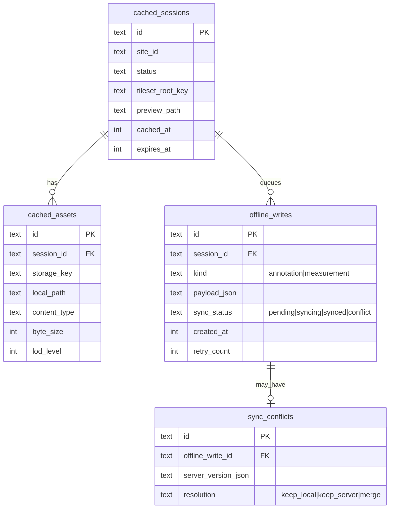
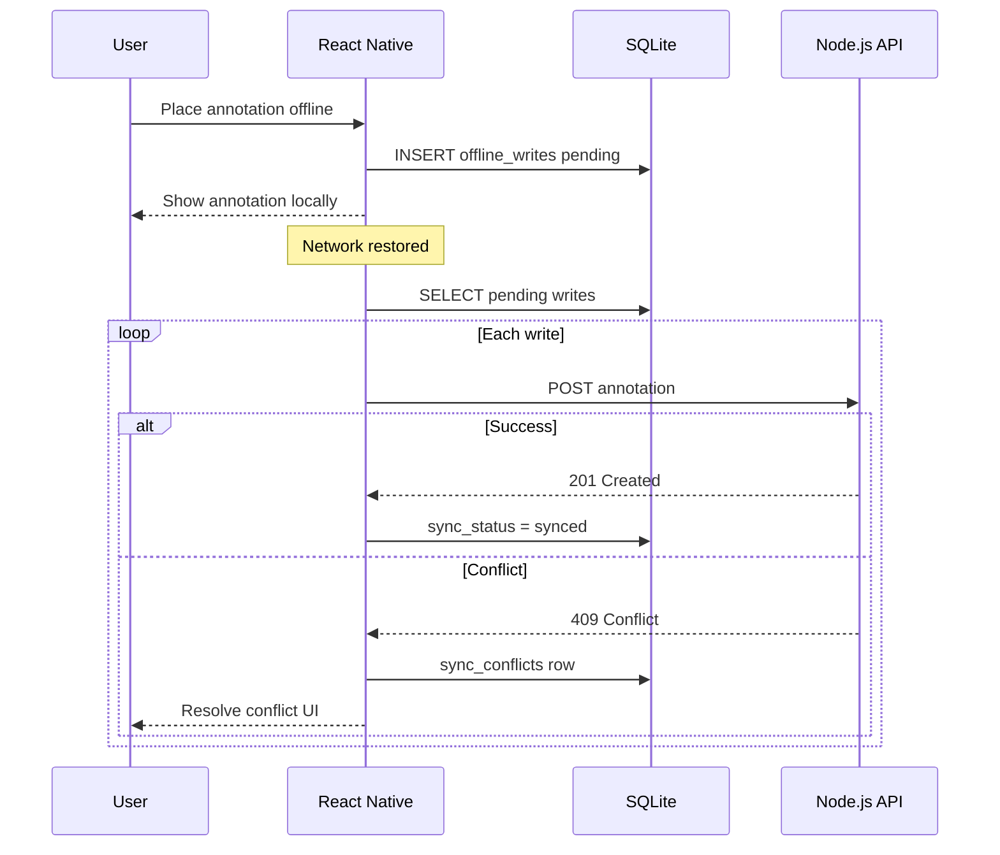

# Storage & Metadata (Mobile)

Cloud storage (S3 object layout, PostgreSQL schema, query flows) is **unchanged** from the web application. See [web 02-storage-and-metadata.md](../web-application/02-storage-and-metadata.md).

This document covers the **on-device** storage layer: what the mobile app caches locally, how keys map to cloud objects, offline writes, and signed-URL handling when the app is backgrounded.

---

## Local Cache Tiers

| Tier | Technology | Contents | Typical size |
|------|------------|----------|--------------|
| Key-value | MMKV | Auth tokens (encrypted), user prefs, last-sync timestamps, network mode | < 1 MB |
| Structured | SQLite | Session list, annotation/measurement metadata, sync queue rows | 5–50 MB |
| Filesystem | App cache directory | Downloaded `.b3dm` tiles, preview images, cached PDF reports | 100 MB–2 GB |

### MMKV keys (examples)

```
auth.refresh_token          # encrypted
auth.user_id
settings.wifi_only_tiles    # boolean, F-MOB-05
settings.biometric_enabled
cache.last_session_sync.{siteId}
```

### SQLite schema (mobile-local)



---

## Cache Key Mirroring

Downloaded files use the same logical key as object storage, rooted under the app cache directory:

```
{cacheRoot}/
  org/{orgId}/site/{siteId}/session/{sessionId}/
    tiles/{level}/{x}_{y}.b3dm
    preview/overview.jpg
    tileset.json
```

`CacheManager.getLocalPath(storageKey)` returns the filesystem path if the file exists and is not expired; otherwise it enqueues a download (respecting `settings.wifi_only_tiles`).

---

## Offline Write Queue

When the device has no connectivity, annotations and measurements are inserted into `offline_writes` with `sync_status = pending`.



### Conflict resolution

| Strategy | When used |
|----------|-----------|
| `keep_local` | User confirms local version wins |
| `keep_server` | Discard local; refresh from API |
| `merge` | v1+; merge non-overlapping fields |

---

## Signed-URL Expiry on Resume

Pre-signed URLs typically expire in 15–60 minutes. Mobile apps are frequently backgrounded longer than that.

**Flow on app resume:**

1. `AppState` changes to `active`.
2. `SessionRepository` checks `cached_sessions.expires_at` for the open session.
3. If expired or within 5 minutes of expiry, call `GET /api/sessions/{id}/tileset` for fresh URLs.
4. Pass new URLs to WebView via `ViewerBridge.postMessage({ type: 'loadTileset', ... })`.
5. Never embed JWT in WebView URL query strings; use short-lived viewer tokens or postMessage auth handoff (see [03-streaming-and-viewing.md](./03-streaming-and-viewing.md)).

---

## Eviction Policy

| Trigger | Action |
|---------|--------|
| Cache exceeds user budget (Settings) | LRU evict oldest `cached_assets` by `cached_at` |
| Session marked deleted server-side | Remove all keys under `session/{sessionId}/` |
| Low disk space (OS callback) | Evict tiles first, keep SQLite metadata |
| User clears cache in Settings | Wipe filesystem cache; retain auth in MMKV |

### Storage budget by device tier (default)

| Device class | Default max cache | Wi-Fi-only default |
|--------------|-------------------|--------------------|
| Phone (< 64 GB) | 500 MB | On |
| Phone (64 GB+) | 1 GB | Off |
| Tablet | 2 GB | Off |

User can override in Settings (F-MOB-05).

---

## Query Flow: Open Cached Session Offline

1. User taps session in list (no network).
2. App queries SQLite: `SELECT * FROM cached_sessions WHERE id = ?`.
3. If `tileset_root_key` exists and `preview_path` on disk, load WebView with `file://` or bundled viewer page + local tile paths.
4. Annotations from `offline_writes` where `sync_status != synced` merged into viewer state.
5. Banner: "Offline — changes will sync when connected."
