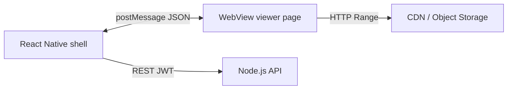
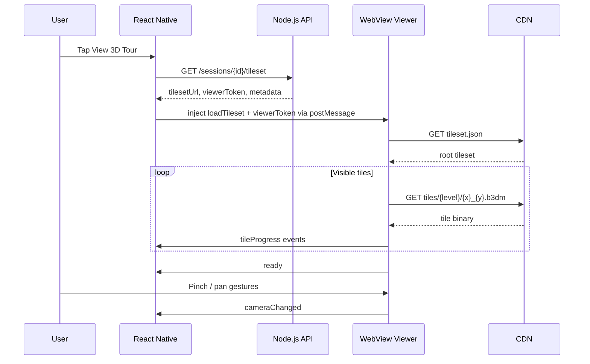
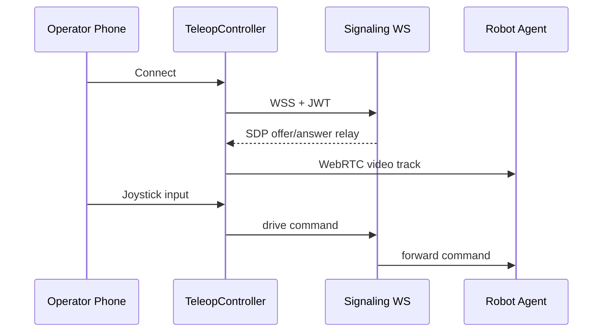

# Streaming & Viewing (Mobile)

Covers the hybrid 3D viewer (WebView + shared web Three.js/Cesium 3D Tiles), the native WebRTC teleop path, and mobile-specific LOD/memory budgets. Cloud reconstruction pipeline is unchanged — see [web 03-streaming-and-viewing.md](../web-application/03-streaming-and-viewing.md).

---

## Hybrid 3D Viewer Architecture

The mobile app does **not** reimplement the tile loader. It hosts the same web viewer used by the dashboard inside a `react-native-webview` and communicates via `postMessage`.



---

## WebView Bridge Protocol

All messages are JSON strings. Direction: **RN → WebView** (commands), **WebView → RN** (events).

### RN → WebView (commands)

| Message `type` | Payload | Description |
|----------------|---------|-------------|
| `loadTileset` | `{ sessionId, tilesetUrl, authToken, annotations[], measurements[] }` | Initialize viewer for a session |
| `setCamera` | `{ position, target, fov }` | Programmatic camera (e.g. jump to annotation) |
| `setTool` | `{ tool: 'navigate' \| 'measure' \| 'annotate' }` | Active tool mode |
| `dispose` | `{}` | Tear down WebGL context before unmount |

### WebView → RN (events)

| Message `type` | Payload | Description |
|----------------|---------|-------------|
| `ready` | `{}` | Viewer JS loaded and listening |
| `tileProgress` | `{ loaded, total, bytesMb, lodLevel }` | Tile loading progress (F-VIEW-09) |
| `cameraChanged` | `{ position, heading }` | Update minimap dot |
| `measurementResult` | `{ points[], valueMeters, label }` | User completed measurement |
| `annotationPlaced` | `{ position, label, severity }` | User placed pin |
| `error` | `{ code, message }` | Load or render failure |

### Example messages

```json
// RN → WebView
{ "type": "loadTileset", "sessionId": "uuid", "tilesetUrl": "https://cdn.../tileset.json?...", "authToken": "viewer-jwt-short" }

// WebView → RN
{ "type": "tileProgress", "loaded": 24, "total": 38, "bytesMb": 128, "lodLevel": 2 }
```

---

## Open Session Sequence



---

## Auth Handoff (No JWT in URL)

| Approach | v1 choice | Rationale |
|----------|-----------|-----------|
| JWT in WebView URL query | **Rejected** | Leaks in logs, referrer, screenshots |
| Cookie set via `injectJavaScript` | Rejected | Fragile across WebView resets |
| Short-lived viewer token in `postMessage` | **Chosen** | API issues 15-min scoped token; RN passes once on `loadTileset` |
| Native header injection | N/A | WebView tile fetches go direct to CDN with signed URLs, not API |

Viewer page validates `viewerToken` once, then uses signed tile URLs from tileset JSON (same as web).

---

## Mobile LOD and Memory Budgets

Compared to [web desktop budgets](../web-application/03-streaming-and-viewing.md):

| Parameter | Web desktop | Mobile phone | Mobile tablet |
|-----------|-------------|--------------|---------------|
| Max GPU memory for tiles | 512 MB | **128 MB** | 256 MB |
| Max concurrent tile requests | 8 | **3** | 5 |
| Default max SSE (pixels) | 16 | **24** (coarser) | 20 |
| Tile request timeout | 10 s | 15 s | 12 s |

Configured in WebView via `loadTileset` payload: `{ memoryBudgetMb: 128, maxConcurrent: 3 }`.

When memory pressure warning fires (iOS `memoryWarning`, Android `onTrimMemory`), RN sends `dispose` and reloads with coarser LOD on next open.

---

## Native Teleoperation (react-native-webrtc)

Teleop does **not** use WebView. Video and drive commands use native modules.

| Concern | Implementation |
|---------|----------------|
| Permissions | `CAMERA`, `RECORD_AUDIO` (Android); camera/mic usage strings (iOS Info.plist) |
| Audio session | iOS `AVAudioSessionCategoryPlayAndRecord`; Android `MODE_IN_COMMUNICATION` |
| Background | iOS: connection drops after ~30 s unless audio background mode; show reconnect UI |
| Network handoff | Wi-Fi ↔ cellular: ICE restart via signaling; `TeleopController.reconnect()` |
| Drive commands | WebSocket to Media/Signaling Service (same as web) |
| E-stop | Native button → immediate WS message; bypasses command queue |



---

## Cellular Data Guard (F-MOB-05)

When `settings.wifi_only_tiles` is true:

- Block new tile downloads on cellular; allow cached tiles only.
- Teleop WebRTC still allowed (user explicitly started session).
- Show banner: "Wi-Fi required for new 3D data."

When user opens viewer on cellular with guard on, offer "Download on Wi-Fi" queue.

---

## Error Handling

| Failure | Mobile behavior |
|---------|-----------------|
| WebView OOM | `dispose`, toast, suggest closing other apps |
| Signed URL 403 | Refresh URLs from API, retry once |
| WebView crash (iOS JIT) | Reload viewer page; preserve session id |
| Teleop ICE failed | 3 reconnect attempts; then "Check network" |
| Offline + no cache | "Session not available offline" with download CTA |
