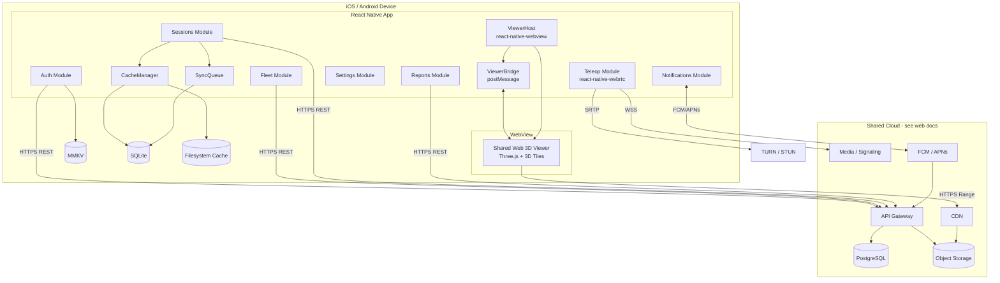

# Component Diagram

Mobile client components, the WebView viewer container, and shared backend services. Connectors are labeled with protocol.

---

## System Component Diagram

---

## Component Responsibilities

### Native Modules

**Auth Module**
- Sign-in, token refresh, secure storage in MMKV
- Biometric gate on app resume (F-MOB-03)
- Implements: F-AUTH-01, F-AUTH-03, F-MOB-03

**Fleet Module**
- Site and robot list; status cards
- QR scan for robot pairing (F-MOB-04)
- Implements: F-FLEET-03, F-FLEET-05, F-MOB-04

**Sessions Module**
- Session list, detail, reconstruction status
- Triggers cache download and offline open
- Implements: F-SESSION-*, F-HIST-01, F-MOB-02

**Teleop Module**
- Native WebRTC video, joystick, E-stop
- Does not use WebView
- Implements: F-TELEOP-*

**Reports Module**
- Report list, PDF preview, system share sheet
- Implements: F-REPORT-*

**Notifications Module**
- FCM/APNs registration, in-app inbox, badge counts
- Routes taps to DeepLinkRouter (F-MOB-06)
- Implements: F-MOB-01, F-NOTIF-01

**Settings Module**
- Wi-Fi-only tiles, cache size, biometric toggle, clear cache
- Implements: F-MOB-05

**CacheManager**
- Download tiles/previews to filesystem; SQLite index
- Eviction LRU; respects network mode
- Implements: F-MOB-02, F-MOB-05

**SyncQueue**
- Flush offline_writes on connectivity restore
- Conflict detection and user resolution UI
- Implements: F-MOB-02

**ViewerHost + ViewerBridge**
- Mount WebView, inject viewer bundle or remote URL
- Serialize bridge messages both directions
- Refresh viewer tokens on resume
- Implements: F-VIEW-*

**WebViewer (inside WebView)**
- Same Three.js + Cesium 3D Tiles code as web dashboard
- Listens for `postMessage`; emits progress and user actions
- Implements: F-VIEW-01 through F-VIEW-09 (in WebView context)

---

## Interface Summary

| From | To | Protocol | Notes |
|------|----|----------|-------|
| Native modules | API Gateway | HTTPS REST + JWT | Same API as web |
| Teleop | Media/Signaling | WSS | Drive commands |
| Teleop | TURN | SRTP/UDP | Video |
| ViewerBridge | WebViewer | postMessage JSON | In-process |
| WebViewer | CDN | HTTPS Range | Signed URLs |
| Notifications | FCM/APNs | Push | Server-initiated |
| CacheManager | Filesystem | Local I/O | No network |

---

## Shared vs Mobile-Only

| Component | Web | Mobile |
|-----------|-----|--------|
| API, PostgreSQL, Object Storage, CDN, Workers | Shared | Shared |
| React dashboard UI | Web only | — |
| React Native shell | — | Mobile only |
| WebView 3D viewer | Browser tab | Embedded |
| MMKV / SQLite / SyncQueue | — | Mobile only |
| FCM / APNs | — | Mobile only |
