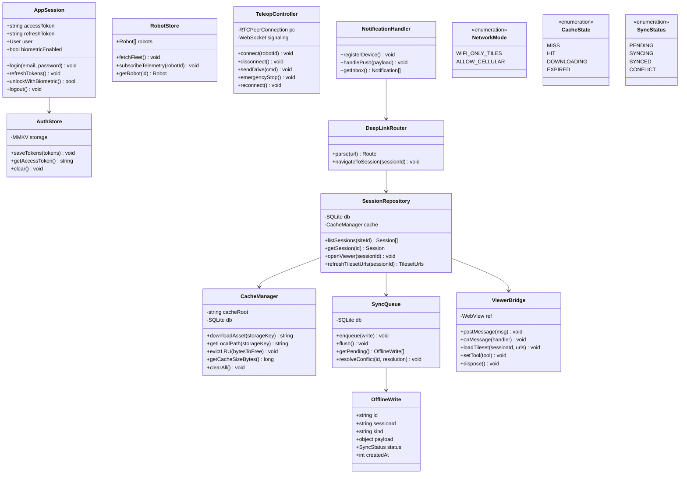
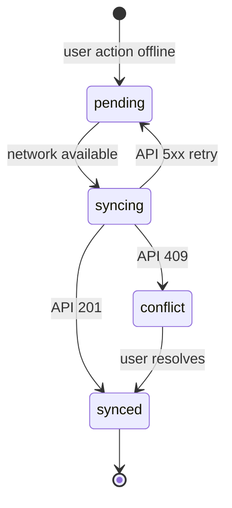
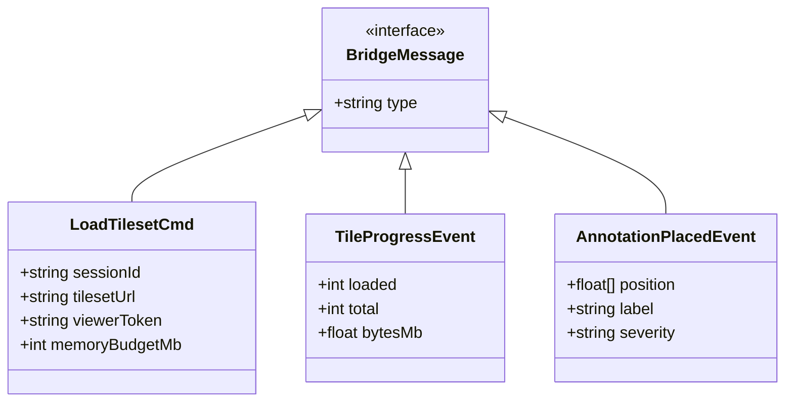

# Class Diagram

Mobile client domain and infrastructure classes. Backend domain classes match [web 05-class-diagram.md](../web-application/05-class-diagram.md) where applicable.

---

## Mobile Client Classes

---

## Sync Queue State Machine

---

## ViewerBridge Message Types

---

## Key Relationships

| Relationship | Cardinality | Notes |
|--------------|-------------|-------|
| SessionRepository → CacheManager | 1 : 1 | All tile paths resolved through cache |
| SessionRepository → ViewerBridge | 1 : 0..1 | Bridge only when viewer screen mounted |
| SyncQueue → OfflineWrite | 1 : * | One queue, many pending rows |
| TeleopController → RobotStore | * : 1 | Uses robot id from store |

---

## Platform-Specific Implementations

| Class | iOS | Android |
|-------|-----|---------|
| AuthStore biometric | LocalAuthentication | BiometricPrompt |
| NotificationHandler | APNs via expo-notifications | FCM |
| CacheManager filesystem | NSDocumentDirectory/cache | Context.getCacheDir() |
| TeleopController audio | AVAudioSession | AudioManager |

Details in [07-platform-constraints.md](./07-platform-constraints.md).
