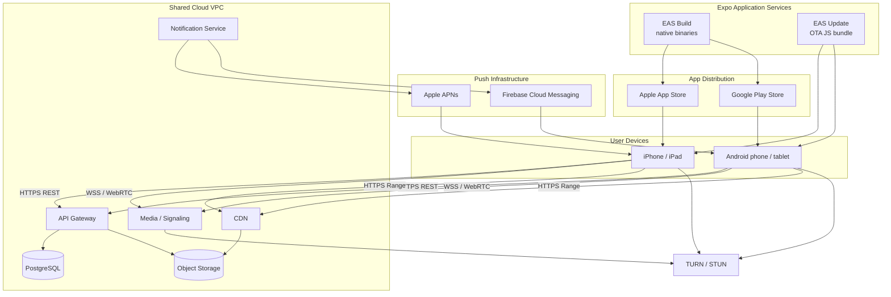
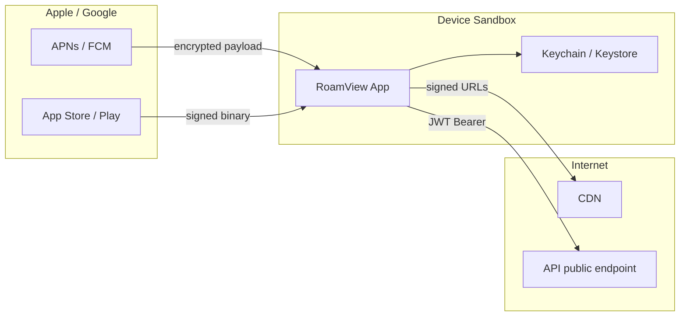

# Deployment Diagram

Deployment of the RoamView mobile client on iOS and Android devices, distribution through app stores, push infrastructure, and connection to the shared cloud backend documented in [web 06-deployment-diagram.md](../web-application/06-deployment-diagram.md).

---

## Deployment Overview

---

## Artifacts on Device

| Artifact | Location | Update channel |
|----------|----------|----------------|
| Native binary (.ipa / .aab) | Installed via store | EAS Build → store review |
| JavaScript bundle | Embedded or OTA | EAS Update (no review) |
| Web viewer assets | Bundled in app or CDN | OTA with JS bundle |
| Cached tiles | App sandbox cache | User-managed eviction |
| SQLite / MMKV | App sandbox | Migrations in JS bundle |

---

## OTA vs Store Review

| Change type | Delivery | Store review |
|-------------|----------|--------------|
| JS/React Native logic, UI strings | EAS Update | No |
| WebView viewer bundle (no native API change) | EAS Update | No |
| New native module (e.g. camera) | EAS Build → store | Yes |
| Permission manifest change | EAS Build → store | Yes |
| Expo SDK major upgrade | EAS Build → store | Yes |

---

## Trust Boundaries

| Boundary | Authentication |
|----------|----------------|
| App → API | JWT in `Authorization` header |
| App → CDN | Pre-signed URL in tile requests |
| App → TURN | ICE credentials from signaling |
| Push → App | Device token registered server-side |
| Store → Device | Code signing (Apple/Google) |

---

## Environments

| Environment | API base URL | EAS channel | Purpose |
|-------------|--------------|-------------|---------|
| `development` | `http://localhost:3000` | `development` | Simulator + local API |
| `staging` | `https://api.staging.roamview.app` | `preview` | TestFlight / internal track |
| `production` | `https://api.roamview.app` | `production` | App Store / Play production |

Build profiles in `eas.json` map branches to channels.

---

## Port and Protocol Reference

| Path | Protocol | Port | Notes |
|------|----------|------|-------|
| REST API | HTTPS | 443 | Same as web |
| Signaling | WSS | 443 | Teleop |
| WebRTC media | SRTP/UDP | 3478 | TURN |
| Tile CDN | HTTPS | 443 | Range requests |
| APNs | HTTP/2 | 443 | Apple push gateway |
| FCM | HTTPS | 443 | Google push |

---

## Scaling Notes

| Component | Mobile impact |
|-----------|---------------|
| API | Same horizontal scaling as web clients |
| CDN | Critical for mobile; edge caching reduces latency on cellular |
| TURN | Mobile NAT traversal often requires relay; monitor TURN capacity |
| Push | FCM/APNs handle device fan-out; server sends to NotifSvc only |
