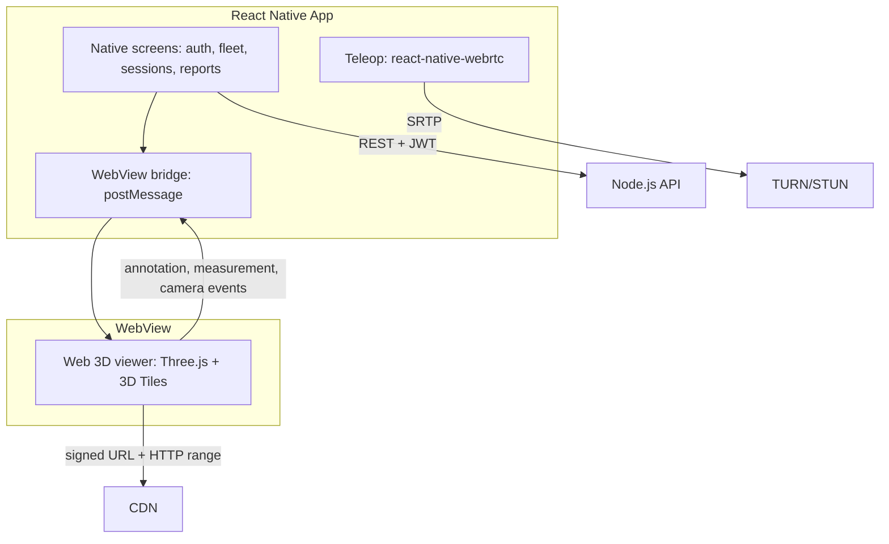

# RoamView Mobile Application Design Documentation

This documentation set describes the **mobile client** slice of RoamView: the React Native app for iOS and Android. The backend (Node.js API, PostgreSQL, object storage, reconstruction workers) is shared with the web application and documented in [Web Application docs](../web-application/README.md).

The mobile app gives field operators and remote stakeholders access to fleet status, live teleoperation, 3D tour viewing, and inspection reports from a phone or tablet.

## Documents

| # | Document | Description |
|---|----------|-------------|
| 1 | [Feature List](./01-feature-list.md) | Web parity matrix, mobile-only features, diagram traceability |
| 2 | [Storage & Metadata](./02-storage-and-metadata.md) | On-device cache tiers, offline queue, signed-URL handling |
| 3 | [Streaming & Viewing](./03-streaming-and-viewing.md) | WebView bridge, mobile LOD budgets, native WebRTC teleop |
| 4 | [Component Diagram](./04-component-diagram.md) | Native modules, WebView container, shared backend |
| 5 | [Class Diagram](./05-class-diagram.md) | Mobile client classes and sync queue state machine |
| 6 | [Deployment Diagram](./06-deployment-diagram.md) | App stores, EAS, push infra, OTA vs store review |
| 7 | [Platform Constraints](./07-platform-constraints.md) | WebView vs native decision, permissions, mobile limits |

## UI/UX Mockups

Phone-frame mockups — open [`mockups/index.html`](./mockups/index.html) only (all screens in one file).

```bash
./docs/mobile-application/mockups/serve.sh   # optional: opens http://localhost:8766/index.html
```

## Architecture Overview



## Technology Stack

| Layer | Technology |
|-------|------------|
| Framework | React Native, Expo |
| 3D Viewer | WebView hosting shared web viewer (Three.js + Cesium 3D Tiles) |
| Live Video | react-native-webrtc |
| Local cache | MMKV (key-value), SQLite (metadata), filesystem (tiles) |
| Push | FCM (Android), APNs (iOS) |
| Auth | JWT + biometric unlock (Face ID / fingerprint) |
| Backend | Shared Node.js API (see [web docs](../web-application/README.md)) |

## Related

- [Web Application docs](../web-application/README.md)
- [RoamView Project Proposal](../../RoamView_Project_Proposal.pdf)
