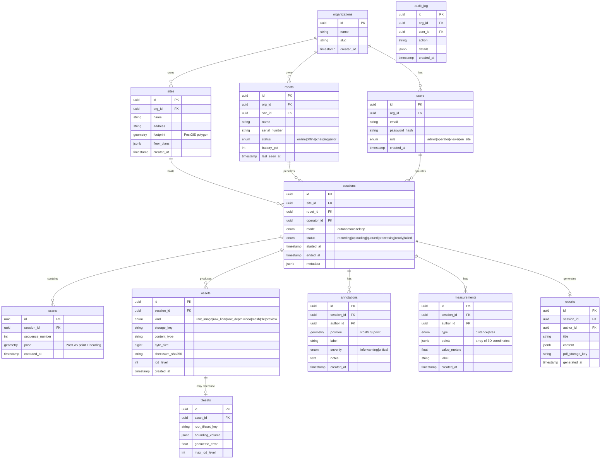
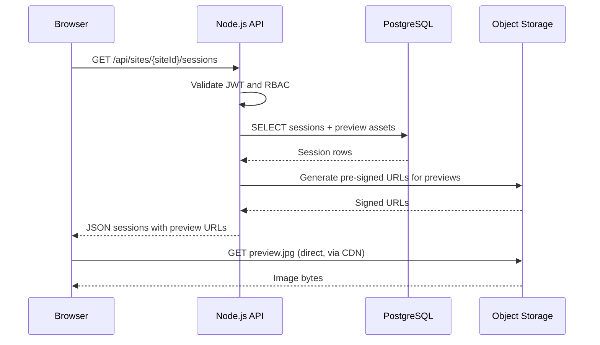
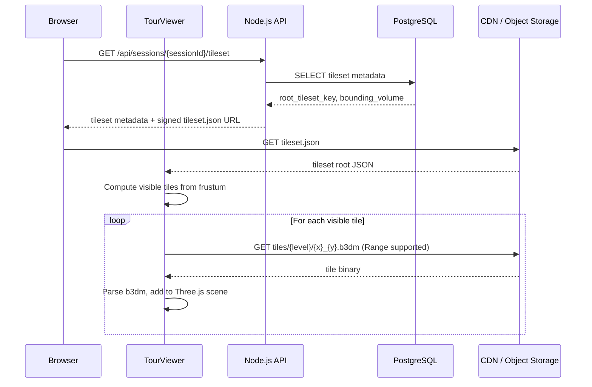
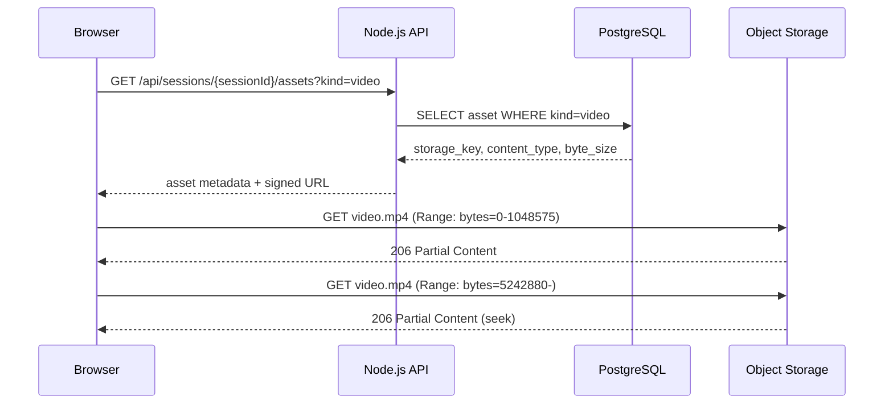

# Storage & Metadata

RoamView uses a **hybrid storage model**: PostgreSQL holds structured metadata and pointers; an S3-compatible object store holds all large binary assets (meshes, 3D Tiles, video, raw sensor captures). The API never proxies file bytes — it resolves metadata in Postgres and returns short-lived pre-signed URLs so the browser streams directly from the CDN/object store.

---

## Object Storage Layout

All keys are scoped under an organization prefix. No two tenants share a bucket prefix.

```
org/{orgId}/
  site/{siteId}/
    session/{sessionId}/
      raw/
        images/{frameIndex}.jpg
        lidar/{scanIndex}.pcd
        depth/{frameIndex}.png
      video/
        live_recording.mp4
        thumbnail.jpg
      mesh/
        dense_cloud.ply
        textured_mesh.obj
        textured_mesh.mtl
        textures/{name}.jpg
      tiles/
        tileset.json
        {level}/{x}_{y}.b3dm
        {level}/{x}_{y}.json
      preview/
        overview.jpg
        minimap.png
```

### Key conventions

| Prefix | Content | Typical size | Retention |
|--------|---------|--------------|-----------|
| `raw/` | Source sensor data from robot | 500 MB – 5 GB per session | 90 days, then cold tier |
| `video/` | Recorded live stream + thumbnail | 100 MB – 1 GB | Indefinite |
| `mesh/` | OpenMVS output (PLY, OBJ) | 50 MB – 500 MB | Indefinite |
| `tiles/` | Cesium 3D Tiles tileset | 20 MB – 2 GB | Indefinite |
| `preview/` | Low-res overview images | < 1 MB | Indefinite |

### Content types

| Extension | MIME type |
|-----------|-----------|
| `.b3dm` | `application/octet-stream` |
| `.json` (tileset) | `application/json` |
| `.ply` | `application/octet-stream` |
| `.obj` | `model/obj` |
| `.mp4` | `video/mp4` |
| `.jpg` | `image/jpeg` |
| `.pcd` | `application/octet-stream` |

---

## PostgreSQL Schema



### Indexing strategy

```sql
-- Session list per site, newest first
CREATE INDEX idx_sessions_site_captured
  ON sessions (site_id, started_at DESC);

-- Asset lookup by session and kind
CREATE INDEX idx_assets_session_kind
  ON assets (session_id, kind);

-- Spatial queries on annotations
CREATE INDEX idx_annotations_position
  ON annotations USING GIST (position);

-- Audit log per org, newest first
CREATE INDEX idx_audit_org_created
  ON audit_log (org_id, created_at DESC);
```

### Retention policy

| Data class | Hot storage | Cold/archive | Delete |
|------------|-------------|--------------|--------|
| `raw/` sensor data | 90 days | S3 Glacier after 90 days | After 1 year |
| `tiles/`, `mesh/`, `video/` | Indefinite | — | Manual only |
| `preview/` | Indefinite | — | With session |
| PostgreSQL rows | Indefinite | — | Cascade on org delete |

---

## Query Flows

### Flow 1: Load a site's session list

**Trigger:** User opens the Sessions page for a site.

1. Browser sends `GET /api/sites/{siteId}/sessions?limit=20&offset=0` with JWT.
2. API validates JWT, checks org membership and site access.
3. API queries Postgres:
   ```sql
   SELECT s.id, s.mode, s.status, s.started_at, s.ended_at,
          r.name AS robot_name, u.email AS operator_email,
          a.storage_key AS preview_key
   FROM sessions s
   JOIN robots r ON r.id = s.robot_id
   LEFT JOIN users u ON u.id = s.operator_id
   LEFT JOIN assets a ON a.session_id = s.id AND a.kind = 'preview'
   WHERE s.site_id = $1
   ORDER BY s.started_at DESC
   LIMIT 20 OFFSET 0;
   ```
4. API generates pre-signed URLs (15 min TTL) for each `preview_key`.
5. API returns JSON array with session metadata and preview URLs.
6. Browser renders session cards with thumbnails.



---

### Flow 2: Open a session in the 3D viewer

**Trigger:** User clicks "View 3D Tour" on a ready session.

1. Browser sends `GET /api/sessions/{sessionId}/tileset` with JWT.
2. API validates access; queries Postgres for the tileset asset:
   ```sql
   SELECT t.root_tileset_key, t.bounding_volume, t.geometric_error, t.max_lod_level
   FROM tilesets t
   JOIN assets a ON a.id = t.asset_id
   WHERE a.session_id = $1 AND a.kind = 'tile';
   ```
3. API returns tileset metadata plus a pre-signed URL for `tileset.json` (1 hour TTL).
4. Browser fetches `tileset.json` directly from CDN/object store.
5. `TilesetLoader` parses the root tile, computes visible tiles from camera frustum.
6. For each visible tile, browser requests `.../tiles/{level}/{x}_{y}.b3dm` via pre-signed URL or CDN (no API round-trip per tile).
7. Three.js renders loaded tiles; `LODController` evicts distant tiles to stay within memory budget.



---

### Flow 3: Fetch a single asset (video playback)

**Trigger:** User plays back a recorded session video.

1. Browser sends `GET /api/sessions/{sessionId}/assets?kind=video` with JWT.
2. API queries Postgres for the video asset row.
3. API returns asset metadata and a pre-signed URL (2 hour TTL).
4. Browser's `<video>` element sets `src` to the signed URL.
5. Browser sends HTTP `Range: bytes=0-` requests directly to object store for seeking.
6. No bytes pass through the Node.js API.



---

## Postgres BLOB vs Object Storage — Trade-off

The original project proposal specified storing 3D maps as BLOBs in PostgreSQL. The hybrid model below is the chosen approach for the web application.

| Concern | PostgreSQL BLOB | Object Storage + Postgres metadata |
|---------|-----------------|-------------------------------------|
| HTTP Range requests | Not supported natively; requires API proxy | Native S3 Range support; browser seeks video and partial tile loads work |
| CDN caching | Cannot cache through CDN | CDN edge caches tiles and video globally |
| Connection pool pressure | Large reads tie up DB connections | DB handles only small metadata queries |
| Partial tile loading | Must read entire BLOB or implement custom chunking | Each `.b3dm` file is independently addressable |
| Backup & replication | DB backups grow with every session | Object store has independent lifecycle policies |
| Cost at scale | Expensive DB storage ($/GB) | S3 Standard ~$0.023/GB; Glacier for raw data |
| Transactional integrity | Single ACID transaction for metadata + blob | Two-phase: write to S3, then insert metadata row; compensating delete on failure |
| Query complexity | Simple (one table) | Requires join between `assets` and object key |

**Decision:** Use object storage for all assets ≥ 1 MB. PostgreSQL stores only metadata, spatial data, and relational links. The `assets` table's `storage_key` column is the single source of truth for where bytes live.

**Compensating transaction pattern:**
1. Upload bytes to S3 with a staging key.
2. Insert `assets` row with `storage_key`.
3. On DB insert failure, delete the S3 object.
4. On success, promote staging key to final key (or use the staging key directly).
