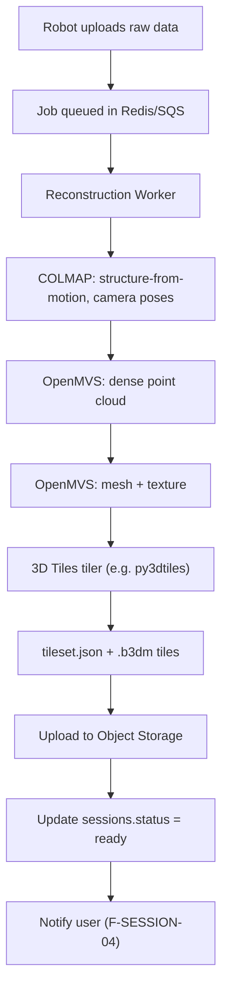
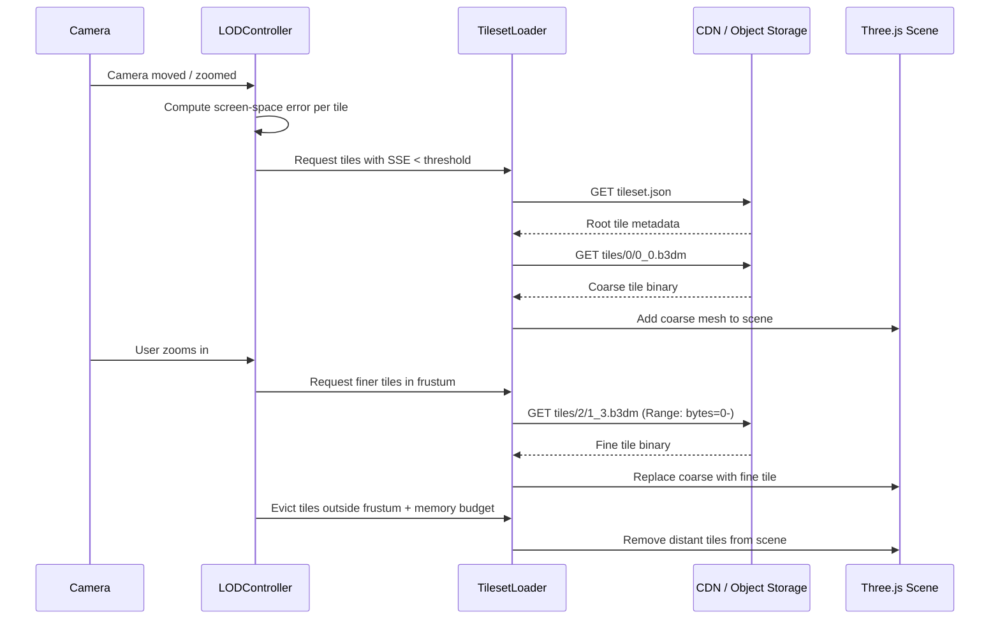
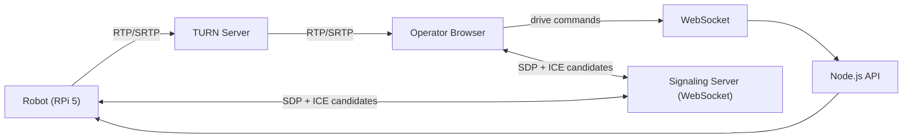

# Streaming & Viewing

This document covers two distinct streaming paths in RoamView:

1. **Live video** — WebRTC for real-time teleoperation (low latency, peer-to-peer).
2. **3D tile streaming** — Cesium 3D Tiles over HTTP for post-session tour viewing (progressive LOD, CDN-cached).

These are intentionally separate transports because their latency, bandwidth, and caching requirements differ fundamentally.

---

## Reconstruction Pipeline

After a session ends, the robot uploads raw sensor data. A background worker reconstructs a navigable 3D tileset.



### Job states

| State | Description | UI indicator |
|-------|-------------|--------------|
| `recording` | Session in progress on robot | Red dot, "Live" |
| `uploading` | Robot transferring raw data to cloud | Progress bar |
| `queued` | Upload complete, waiting for worker | "Queued" badge |
| `processing` | COLMAP/OpenMVS/tiler running | Spinner + % estimate |
| `ready` | Tileset available in viewer | "View 3D Tour" button enabled |
| `failed` | Pipeline error | Error message + retry button |

State transitions are persisted on `sessions.status` and broadcast to the dashboard via WebSocket.

### Pipeline stages and typical durations

| Stage | Input | Output | Duration (typical) |
|-------|-------|--------|-------------------|
| COLMAP | Raw images + optional LiDAR poses | `cameras.bin`, `images.bin`, sparse point cloud | 5–30 min |
| OpenMVS dense | COLMAP output | `scene_dense.ply` | 10–60 min |
| OpenMVS mesh | Dense cloud | `scene_mesh.obj` + textures | 5–20 min |
| Tiler | Textured mesh | `tileset.json` + `.b3dm` files | 2–10 min |

GPU workers (NVIDIA T4 or better) are recommended for OpenMVS stages. COLMAP can run on CPU.

---

## 3D Tile Streaming (Post-Session Viewer)

### Tileset structure

A Cesium 3D Tiles tileset is a hierarchy of spatially organized 3D content:

```
tileset.json          ← root: bounding volume, geometric error, children refs
  tiles/
    0/0_0.b3dm        ← coarsest LOD (entire scene, low detail)
    1/0_0.b3dm        ← medium LOD, northwest quadrant
    1/0_1.b3dm        ← medium LOD, southwest quadrant
  1/1_0.b3dm
  1/1_1.b3dm
    2/0_0.b3dm        ← finest LOD, small region
    ...
```

Each `.b3dm` file is a binary container wrapping a glTF 2.0 model with Batched 3D Model extensions.

### Viewer loading sequence



### LOD selection algorithm

The `LODController` uses **screen-space error (SSE)** to decide which tiles to load:

```
SSE = (geometricError × viewportHeight) / (distance × 2 × tan(fov/2))
```

- If `SSE > maxSSE` (default 16 pixels): load child tiles (finer detail).
- If `SSE ≤ maxSSE`: current tile is sufficient; do not load children.
- Tiles outside the camera frustum are never requested.
- Tiles beyond `maxDistance` are evicted from GPU memory.

### HTTP Range requests and caching

3D Tiles benefit from HTTP Range support for two reasons:

1. **Partial reads** — Some tile parsers only need the glTF header before requesting the full binary.
2. **Resume on failure** — Interrupted downloads can resume without re-fetching the entire tile.

CDN cache headers on tile objects:

```
Cache-Control: public, max-age=31536000, immutable
Content-Type: application/octet-stream
Accept-Ranges: bytes
```

Tiles are immutable (content-addressed by session ID + LOD level + coordinates), so aggressive caching is safe.

### Three.js + Cesium 3D Tiles integration

```
TourViewer
  └── TilesetLoader
        └── Cesium3DTileset (from 3d-tiles-renderer library)
              └── Three.js Object3D per tile
                    └── glTF meshes with PBR materials
```

- `3d-tiles-renderer` (npm) provides a `TilesRenderer` class that integrates with Three.js's render loop.
- Each loaded `.b3dm` is parsed into a `THREE.Group` with `THREE.Mesh` children.
- Materials use the glTF PBR metallic-roughness workflow.
- The renderer calls `tilesRenderer.update()` each frame, which triggers LOD evaluation and tile loading/unloading.

### Memory budget

| Device class | Max GPU memory for tiles | Max concurrent tile requests |
|--------------|--------------------------|------------------------------|
| Desktop | 512 MB | 8 |
| Tablet | 256 MB | 4 |
| Mobile | 128 MB | 2 |

When the budget is exceeded, `LODController` evicts the lowest-priority tiles (farthest from camera, highest SSE surplus).

---

## Live Video Streaming (Teleoperation)

Live teleoperation requires sub-500 ms end-to-end latency. HTTP-based streaming (HLS, DASH) introduces 2–10 seconds of buffer delay and is unsuitable for driving a robot.

### WebRTC path



**Signaling flow:**
1. Operator clicks "Connect" → browser opens WebSocket to signaling server.
2. Browser creates `RTCPeerConnection`, generates SDP offer, sends via signaling.
3. Robot Agent receives offer, creates answer, sends back via signaling.
4. ICE candidates exchanged; STUN resolves NAT; TURN relays if direct connection fails.
5. Video track flows peer-to-peer (or via TURN relay).
6. Drive commands flow separately over WebSocket (not through WebRTC data channel, to allow server-side logging and RBAC).

### Stored video playback (post-session)

Recorded sessions are stored as MP4 in object storage. Playback uses standard HTML5 `<video>` with HTTP Range requests — no WebRTC.

| Property | Live (WebRTC) | Stored (HTTP/MP4) |
|----------|---------------|-------------------|
| Latency | < 500 ms | 1–3 s buffer acceptable |
| Seeking | Not supported | HTTP Range seek |
| CDN caching | Not applicable (real-time) | Full CDN cache |
| Protocol | RTP/SRTP over UDP | HTTP/1.1 or HTTP/2 |
| Use case | Teleoperation | Session replay, reports |

---

## Error Handling

| Failure | Detection | Recovery |
|---------|-----------|----------|
| Tile load timeout | 10 s per-tile timeout in `TilesetLoader` | Retry once; show "tile unavailable" placeholder |
| WebRTC connection drop | ICE connection state `failed` | Auto-reconnect with exponential backoff (3 attempts) |
| Reconstruction failure | Worker exit code ≠ 0 | Set `sessions.status = failed`; surface error in UI |
| CDN miss (404 on tile) | HTTP 404 from CDN | Fall back to direct S3 pre-signed URL |
| Memory budget exceeded | `LODController` threshold | Evict lowest-priority tiles; never crash renderer |
