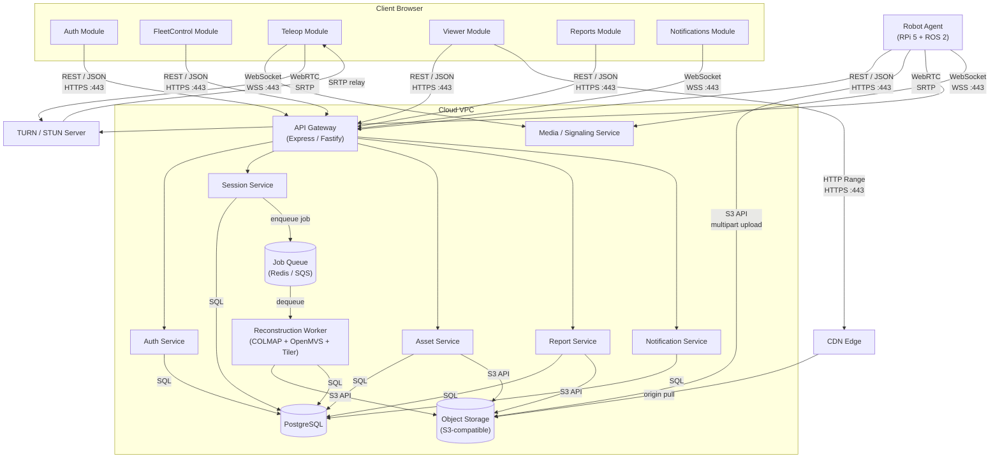

# Component Diagram

The RoamView web application is decomposed into frontend modules, backend services, infrastructure components, and the robot agent. Connectors are labeled with their protocol.

---

## System Component Diagram

---

## Component Responsibilities

### Frontend (React SPA)

**Auth Module**
- Sign-in, sign-up, password reset forms
- JWT storage and refresh token rotation
- Role-gated route rendering
- Implements: F-AUTH-01 through F-AUTH-06

**FleetControl Module**
- Site list and detail pages
- Robot registration and status cards
- Scheduled inspection calendar
- Implements: F-FLEET-01 through F-FLEET-06

**Teleop Module**
- WebRTC video element and connection manager
- Virtual joystick and keyboard drive input
- Telemetry sidebar (battery, speed, heading)
- Emergency stop button
- Implements: F-TELEOP-01 through F-TELEOP-09

**Viewer Module**
- Three.js canvas with Cesium 3D Tiles renderer
- Camera controls (orbit, pan, zoom, walk)
- Measurement and annotation toolbars
- Floor selector and minimap overlay
- Implements: F-VIEW-01 through F-VIEW-09

**Reports Module**
- Report preview and PDF export trigger
- Annotation and measurement summary table
- Implements: F-REPORT-01 through F-REPORT-04

**Notifications Module**
- In-app notification bell and dropdown
- WebSocket subscription for real-time events
- Implements: F-NOTIF-01, F-NOTIF-02

---

### Backend Services

**API Gateway**
- Single entry point for all REST requests
- JWT validation middleware
- Rate limiting and request logging
- Routes to domain services

**Auth Service**
- User registration, login, token issuance
- Password hashing (bcrypt/argon2)
- RBAC enforcement (Admin, Operator, Viewer, On-Site)
- Organization and membership management

**Session Service**
- CRUD for sessions and scans
- Session status state machine (recording → ready)
- Enqueues reconstruction jobs on upload complete
- WebSocket broadcast of status changes

**Asset Service**
- Asset metadata CRUD in PostgreSQL
- Pre-signed URL generation (S3 `getSignedUrl`)
- Multipart upload initiation for robot uploads
- Compensating delete on metadata insert failure

**Report Service**
- Assembles report content from session annotations and measurements
- Renders PDF (e.g. Puppeteer or pdfkit)
- Stores PDF in object storage; records key in `reports` table

**Notification Service**
- Persists notifications in PostgreSQL
- Pushes events to connected WebSocket clients
- Sends email via transactional email provider (v1)

**Media / Signaling Service**
- WebSocket server for WebRTC SDP/ICE exchange
- Relays drive commands from browser to robot (with RBAC check)
- Separate from REST API to keep teleop latency low

**Reconstruction Worker**
- Stateless container; pulls jobs from queue
- Runs COLMAP → OpenMVS → tiler pipeline
- Uploads tileset to object storage
- Updates `sessions.status` and inserts `assets` + `tilesets` rows
- Publishes completion event to notification service

---

### Infrastructure

**Job Queue (Redis / SQS)**
- Decouples session upload from reconstruction processing
- Supports retry with exponential backoff
- Dead-letter queue for permanently failed jobs

**PostgreSQL**
- All structured metadata, spatial data, audit log
- Never stores file bytes

**Object Storage (S3-compatible)**
- All binary assets: raw sensor data, meshes, 3D Tiles, video, PDFs
- Lifecycle rules for raw data tiering

**CDN Edge**
- Caches immutable tile and video objects at edge PoPs
- Serves Range requests for video seeking and partial tile reads

**TURN / STUN Server**
- NAT traversal for WebRTC when robot and operator are behind symmetric NATs
- Required for reliable teleop in enterprise networks

**Robot Agent**
- Runs on Raspberry Pi 5 (ROS 2)
- Uploads session data via S3 multipart API
- Streams live video via WebRTC
- Receives drive commands via WebSocket from Media/Signaling Service
- Reports telemetry (battery, pose, status) via WebSocket

---

## Interface Summary

| From | To | Protocol | Port | Auth |
|------|----|----------|------|------|
| Browser | API Gateway | HTTPS REST/JSON | 443 | JWT Bearer |
| Browser | Media/Signaling | WSS | 443 | JWT (query param) |
| Browser | CDN | HTTPS (Range) | 443 | Pre-signed URL |
| Browser | TURN | SRTP/UDP | 3478 | ICE credentials |
| Robot | API Gateway | HTTPS REST/JSON | 443 | Robot API key |
| Robot | Object Storage | S3 API | 443 | IAM role / key |
| Robot | Media/Signaling | WSS | 443 | Robot API key |
| Robot | TURN | SRTP/UDP | 3478 | ICE credentials |
| API Gateway | PostgreSQL | TCP/SQL | 5432 | DB credentials |
| Worker | PostgreSQL | TCP/SQL | 5432 | DB credentials |
| Worker | Object Storage | S3 API | 443 | IAM role |
| CDN | Object Storage | S3 API (origin) | 443 | Origin access |
