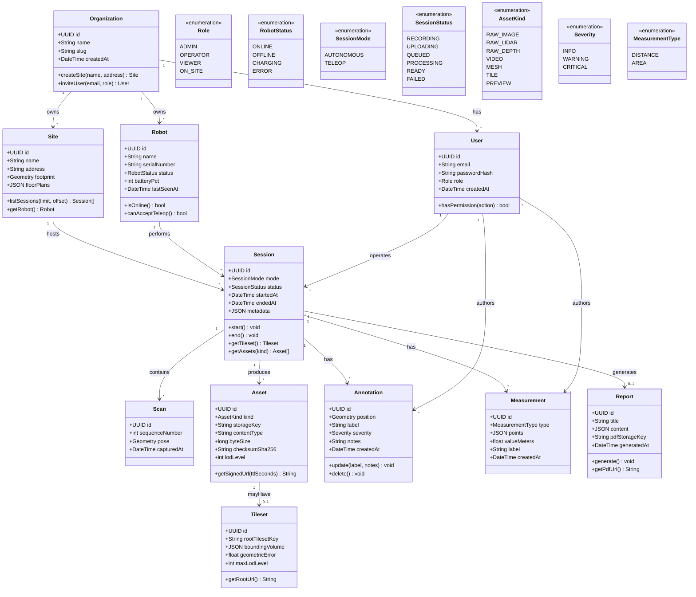
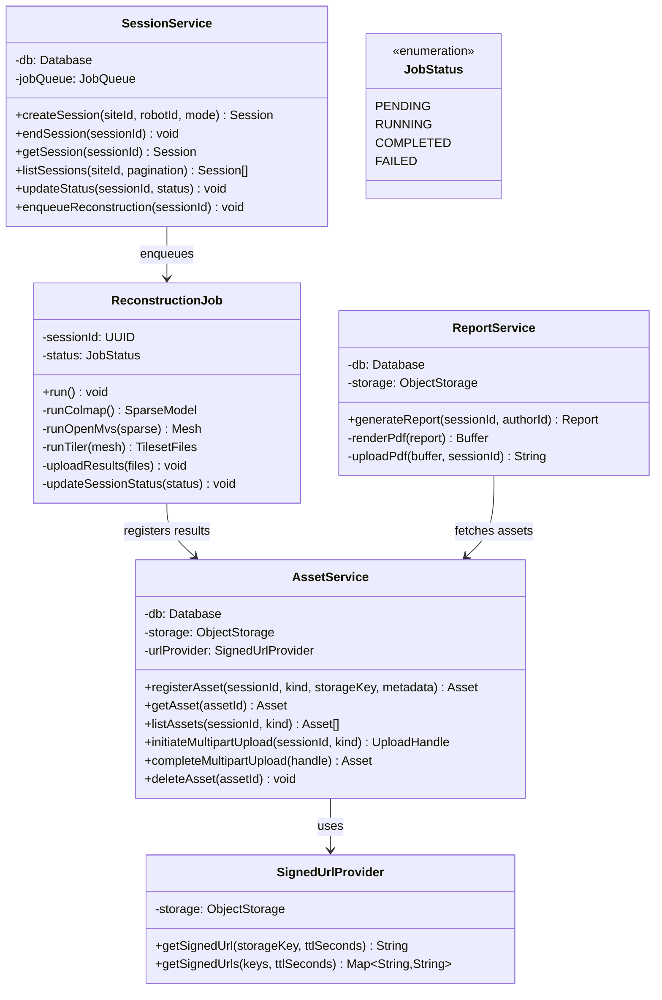
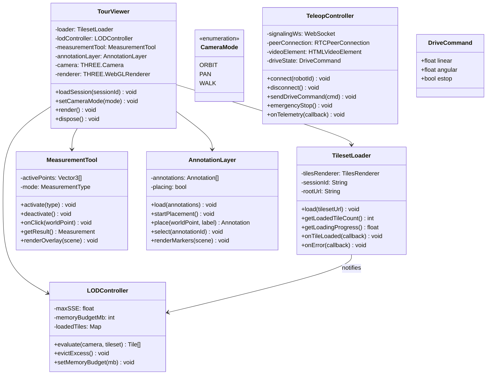
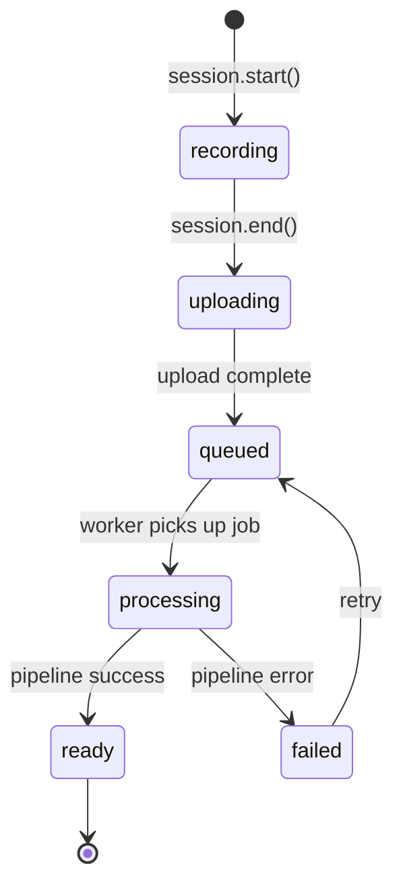
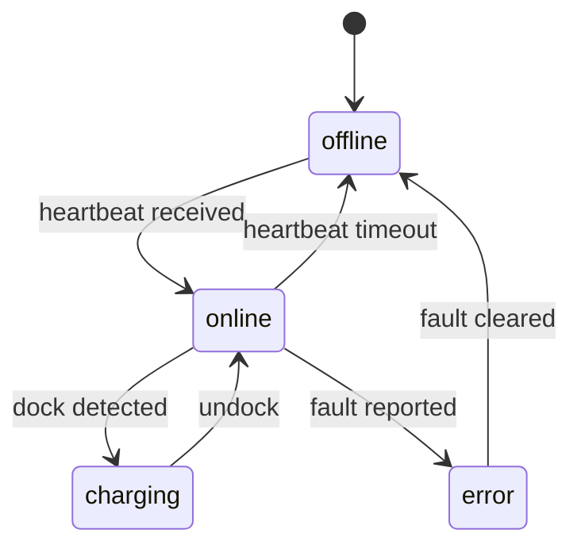

# Class Diagram

Covers the backend domain model, service layer, and frontend viewer classes. Enums define shared state values used across layers.

---

## Domain Model

---

## Service Layer

---

## Frontend Viewer Classes

---

## Key Relationships Summary

| Relationship | Cardinality | Notes |
|--------------|-------------|-------|
| Organization → Site | 1 : * | Tenant isolation boundary |
| Site → Session | 1 : * | All sessions scoped to a site |
| Session → Asset | 1 : * | One session produces many assets |
| Asset → Tileset | 1 : 0..1 | Only `kind=tile` assets have a tileset row |
| Session → Annotation | 1 : * | Placed in viewer, persisted on save |
| TourViewer → TilesetLoader | 1 : 1 | Viewer owns exactly one loader |
| SessionService → ReconstructionJob | 1 : 0..1 | One job per session after upload |

---

## State Machines

### SessionStatus transitions

### RobotStatus transitions

