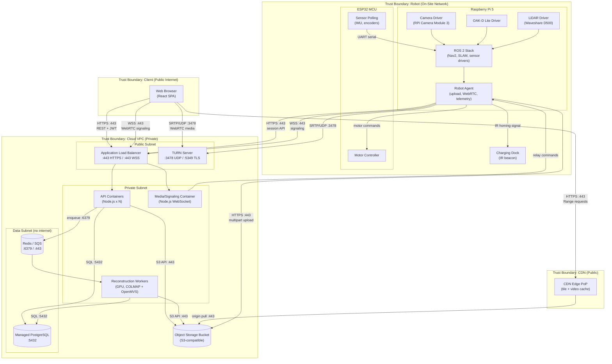
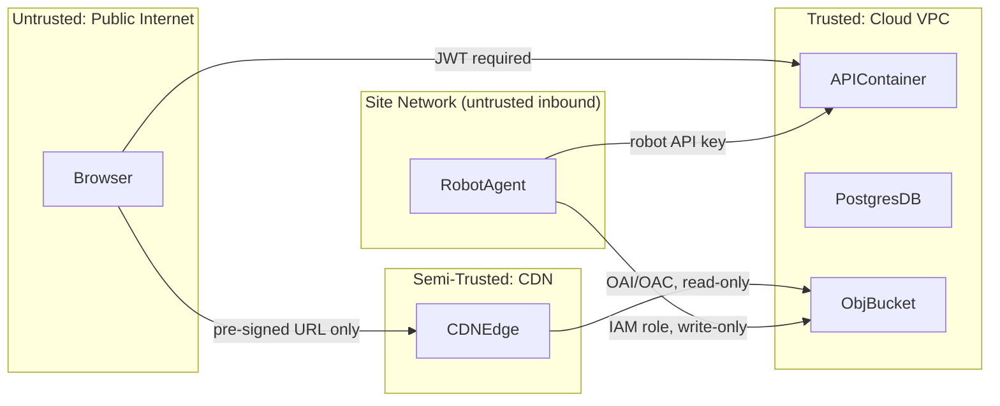

# Deployment Diagram

Physical and logical deployment of RoamView components across the robot, client browser, CDN edge, and cloud VPC. Trust boundaries, protocols, and ports are annotated.

---

## Deployment Overview



---

## Node Descriptions

### Robot (On-Site Network)

| Node | Hardware | Software | Role |
|------|----------|----------|------|
| Raspberry Pi 5 | 4 GB RAM, WiFi | Ubuntu 22.04, ROS 2 Humble | SLAM, navigation, video encoding, cloud upload |
| ESP32 MCU | — | FreeRTOS firmware | Real-time motor control, IMU/encoder polling |
| Charging Dock | IR beacon emitter | — | Autonomous homing and charging |
| Waveshare D500 LiDAR | 360° 2D scan | ROS 2 driver node | SLAM input, obstacle detection |
| OAK-D Lite | RGB + depth | DepthAI SDK | 3D mapping input |
| RPi Camera Module 3 Wide | 1080p | libcamera / GStreamer | Live teleop video feed |

**Network:** Robot connects to site WiFi. Outbound HTTPS/WSS to cloud only; no inbound ports opened on site firewall.

---

### Client Browser

| Property | Value |
|----------|-------|
| Minimum browser | Chrome 90+, Firefox 88+, Safari 15+ |
| Required APIs | WebGL 2.0, WebRTC, WebSocket, Fetch (Range) |
| Deployment | Static files served from CDN or ALB (React build) |
| Auth | JWT stored in `httpOnly` cookie or `sessionStorage` |

---

### CDN Edge

| Property | Value |
|----------|-------|
| Provider | CloudFront, Cloudflare, or equivalent |
| Cached paths | `/org/*/site/*/session/*/tiles/**`, `/org/*/site/*/session/*/video/**` |
| Cache TTL | 1 year (immutable content-addressed tiles) |
| Range support | Required for video seeking |
| Origin | Object storage bucket (private, OAI/OAC access only) |

---

### Cloud VPC

#### Public Subnet

| Service | Container | Ports | Scaling |
|---------|-----------|-------|---------|
| Application Load Balancer | AWS ALB / nginx | 443 (HTTPS), 443 (WSS) | Managed |
| TURN Server | coturn | 3478 UDP, 5349 TLS | 1–2 instances |

#### Private Subnet

| Service | Container image | Ports | Scaling |
|---------|----------------|-------|---------|
| API | `roamview/api:latest` | 3000 (internal) | 2–8 replicas (CPU) |
| Media/Signaling | `roamview/media:latest` | 3001 (internal) | 2–4 replicas (CPU) |
| Reconstruction Worker | `roamview/worker:latest` | — (no inbound) | 0–4 replicas (GPU, scale-to-zero) |

#### Data Subnet

| Service | Type | Ports | Notes |
|---------|------|-------|-------|
| PostgreSQL | Managed (RDS / Cloud SQL) | 5432 | Private subnet only; no public IP |
| Redis / SQS | Managed | 6379 / 443 | Job queue; private subnet only |
| Object Storage | S3 / GCS / MinIO | 443 | Private bucket; CDN OAI access |

---

## Trust Boundaries



| Boundary | Authentication | Authorization |
|----------|---------------|---------------|
| Browser → API | JWT Bearer token | RBAC per org/site |
| Browser → CDN | Pre-signed URL (time-limited) | URL encodes object key + expiry |
| Browser → TURN | ICE username/password (short-lived) | Generated by signaling server |
| Robot → API | Robot API key (per-device) | Scoped to assigned org/site |
| Robot → Object Storage | IAM role (write to `raw/` prefix only) | Least-privilege policy |
| Worker → Object Storage | IAM role (read `raw/`, write `tiles/`/`mesh/`) | Least-privilege policy |
| API → PostgreSQL | DB credentials (Secrets Manager) | Application-level RBAC |

---

## Environments

| Environment | Purpose | Infrastructure |
|-------------|---------|----------------|
| `dev` | Local development | Docker Compose: Postgres, MinIO, Redis, API, worker (CPU only) |
| `staging` | Integration testing, demo | Single-region cloud VPC; 1 API replica; CPU worker |
| `prod` | Production | Multi-AZ VPC; auto-scaling API; GPU workers; CDN enabled |

### Dev environment (Docker Compose)

```yaml
# Simplified — not a committed file, for reference only
services:
  postgres:   { image: postgres:16, ports: ["5432:5432"] }
  minio:      { image: minio/minio, ports: ["9000:9000"] }
  redis:      { image: redis:7, ports: ["6379:6379"] }
  api:        { build: ./api, ports: ["3000:3000"] }
  worker:     { build: ./worker }  # CPU only in dev
  coturn:     { image: coturn/coturn, ports: ["3478:3478/udp"] }
```

---

## Port Reference

| Port | Protocol | Service | Direction |
|------|----------|---------|-----------|
| 443 | HTTPS | ALB → API, Browser → CDN | Inbound to cloud |
| 443 | WSS | ALB → Media/Signaling | Inbound to cloud |
| 3478 | UDP | TURN (STUN binding) | Inbound to cloud |
| 5349 | TLS | TURN (TLS) | Inbound to cloud |
| 5432 | TCP | PostgreSQL | Internal VPC only |
| 6379 | TCP | Redis | Internal VPC only |
| 3000 | TCP | API container | Internal VPC only |
| 3001 | TCP | Media container | Internal VPC only |
| — | UART | ESP32 ↔ RPi 5 | On-robot only |

---

## Scaling Considerations

| Component | Bottleneck | Scale strategy |
|-----------|-----------|----------------|
| API containers | Concurrent REST requests | Horizontal: 2–8 replicas behind ALB |
| Media/Signaling | Concurrent WebRTC sessions | Horizontal: 2–4 replicas; sticky sessions |
| Reconstruction Worker | GPU memory, COLMAP runtime | Scale-to-zero; burst to 4 GPU instances on queue depth |
| Object Storage | None (managed) | Unlimited; lifecycle rules for cost |
| PostgreSQL | Session list queries | Read replica for reporting; connection pooling (PgBouncer) |
| CDN | None (managed) | Global edge; no action needed |
