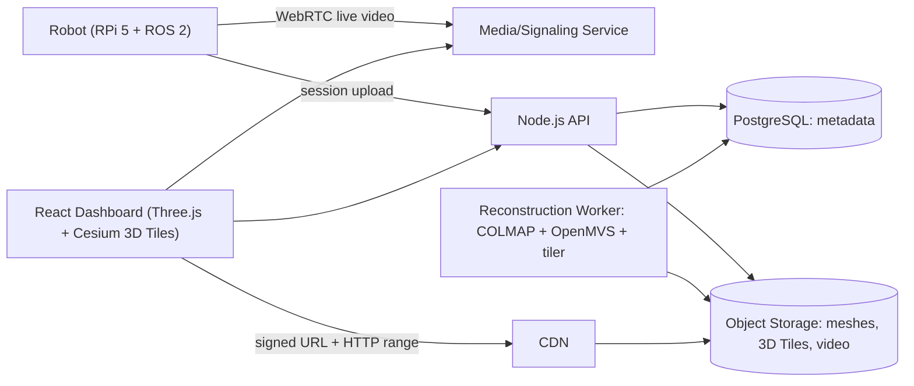

# RoamView Web Application Design Documentation

This documentation set describes the **web application slice** of RoamView: the client dashboard, backend services, cloud storage, and 3D streaming pipeline. The robot (Raspberry Pi 5 + ESP32, ROS 2, sensors) is treated as an external actor that uploads session data and accepts teleoperation commands over the network.

RoamView gives remote stakeholders live, interactive access to physical spaces through autonomous inspections and teleoperated walkthroughs, with every session producing timestamped 3D maps stored in the cloud.

## Documents

| # | Document | Description |
|---|----------|-------------|
| 1 | [Feature List](./01-feature-list.md) | Prioritized features with IDs, actors, and diagram traceability |
| 2 | [Storage & Metadata](./02-storage-and-metadata.md) | Object storage layout, PostgreSQL schema, query flows |
| 3 | [Streaming & Viewing](./03-streaming-and-viewing.md) | Reconstruction pipeline, 3D Tiles streaming, live video |
| 4 | [Component Diagram](./04-component-diagram.md) | System components and interfaces |
| 5 | [Class Diagram](./05-class-diagram.md) | Domain model, services, and frontend viewer classes |
| 6 | [Deployment Diagram](./06-deployment-diagram.md) | Nodes, artifacts, protocols, and trust boundaries |

## UI/UX Mockups

Static HTML/CSS mockups — **open [`mockups/index.html`](./mockups/index.html) only** (all screens are in one file).

```bash
./docs/web-application/mockups/serve.sh   # optional: opens http://localhost:8765/index.html
```

Or double-click `index.html` in Finder. Do not use old `localhost` tabs if the server is not running.

## Architecture Overview



## Technology Stack

| Layer | Technology |
|-------|------------|
| Frontend | React, Three.js, Cesium 3D Tiles |
| Backend | Node.js (REST + WebSocket) |
| Database | PostgreSQL (metadata) |
| Object Storage | S3-compatible (meshes, tiles, video) |
| Reconstruction | COLMAP, OpenMVS |
| Live Video | WebRTC |
| Robot | ROS 2, Nav2, SLAM |

## Related

- [RoamView Project Proposal](../../RoamView_Project_Proposal.pdf)
